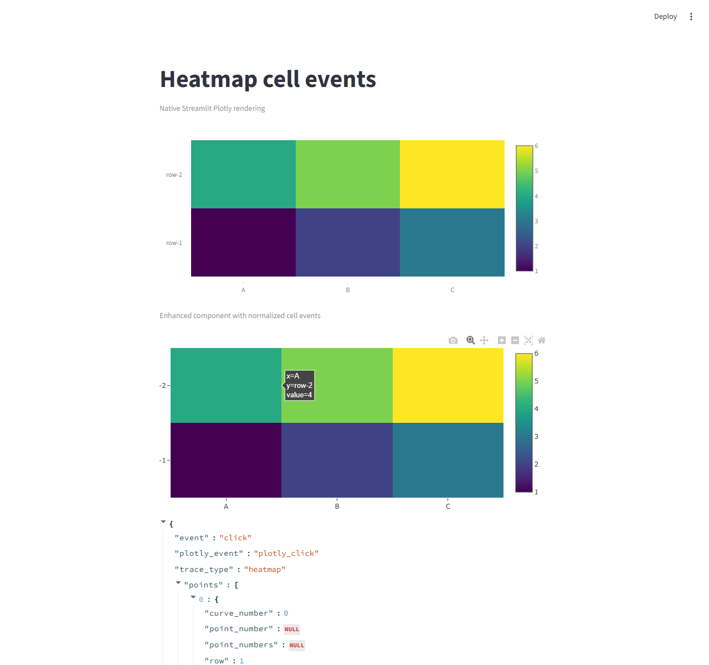

# streamlit-plotly-enhance

Enhanced Plotly interaction helpers for Streamlit Components v2.

`streamlit-plotly-enhance` renders Plotly figures in Streamlit and returns
cell-level interaction events for heatmap-like charts. It is designed for cases
where Streamlit's native `st.plotly_chart` event support is not enough,
especially heatmap cell click events.

## Status

V1 focuses on Plotly heatmap-like charts and click/hover/relayout event
payloads. The package is alpha-stage and intentionally conservative: chart
types that need highly specialized handling may be refined in later versions.

## Installation

Install from PyPI:

```bash
pip install streamlit-plotly-enhance
```

PyPI project page: https://pypi.org/project/streamlit-plotly-enhance/

You can also install the latest source from GitHub:

```bash
pip install git+https://github.com/Jin-Yc/streamlit-plotly-enhance.git
```

## Quick Start

```python
import plotly.graph_objects as go
import streamlit as st

from streamlit_plotly_enhance import plotly_cell_events

st.title("Heatmap cell events")

fig = go.Figure(
    data=go.Heatmap(
        z=[[1, 2, 3], [4, 5, 6]],
        x=["A", "B", "C"],
        y=["row-1", "row-2"],
        colorscale="Viridis",
        name="basic heatmap",
    )
)

event = plotly_cell_events(fig, events=("click",), key="heatmap-basic")
st.json(event or {})
```

Run the example:

```bash
streamlit run examples/readme_demo.py
```

## Demo

The README demo compares native Streamlit Plotly rendering with the enhanced
component. Click a heatmap cell in the enhanced component to get a normalized
event payload.



## Event Payload

Clicking the `A / row-2` cell in the quick-start example returns a normalized
payload like:

```python
{
    "event": "click",
    "plotly_event": "plotly_click",
    "trace_type": "heatmap",
    "points": [
        {
            "curve_number": 0,
            "point_number": None,
            "point_numbers": None,
            "row": 1,
            "col": 0,
            "x": "A",
            "y": "row-2",
            "z": 4,
            "value": 4,
            "customdata": None,
            "text": None,
            "trace_name": "basic heatmap",
            "trace_type": "heatmap",
        }
    ],
    "relayout": None,
}
```

## API

```python
plotly_cell_events(
    fig,
    events=("click",),
    *,
    key=None,
    use_container_width=True,
    height=None,
    config=None,
    theme=None,
    raw_event=False,
)
```

Supported V1 events:

- `click`
- `hover`
- `unhover`
- `relayout`

Primary V1 chart targets:

- `heatmap`
- `image`
- common `px.imshow` outputs
- `contour`
- `histogram2d`
- `histogram2dcontour`

`selected` and `selecting` are not V1 guarantees.

## Test Examples

The `examples/` folder contains small Streamlit apps for the V1 chart targets:

- `examples/readme_demo.py`
- `examples/heatmap_basic.py`
- `examples/imshow_basic.py`
- `examples/image_basic.py`
- `examples/contour_basic.py`
- `examples/histogram2d_basic.py`

Run any example with Streamlit:

```bash
streamlit run examples/heatmap_basic.py
```

Click or hover on the chart, depending on the enabled events in the example,
and inspect the `st.json` payload below the chart.

## License

MIT
